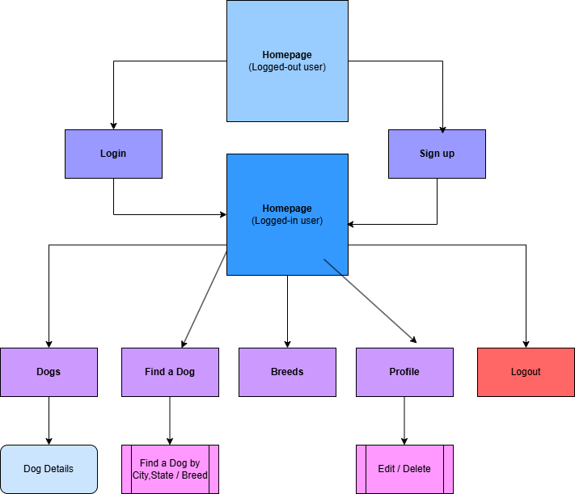

# AdoptaDog 🐶

**AdoptaDog** is a full-stack web application designed to help users find dogs available for adoption across the United States. It connects users with animal welfare organizations, providing **detailed information** about each dog, including breed, age, location, and adoption status.

Built with **Node.js** for the backend and **React with Vite** for the frontend, AdoptaDog leverages the **Petfinder API** to fetch real-time data on adoptable dogs.

🔗 [Click here to visit AdodptaDog](https://adoptapet-wk33.onrender.com)

## 🚀 Features

### User Authentication and Validation

- Secure user authentication with **JWT-based login**, **signup**, and **logout**.
- **User validation** ensures proper entry:
    - **Username**: Must be **unique** and **at least 3 characters** long.
    - **Email**: Must be in a **valid format** (e.g. example@mail.com)
    - **Password**: must be **at least 8 characters** long, and contain **at least one number and one uppercase letter**.

### User Profile Management

- Users can **edit their first and last name**.
- Users can **delete their account** at any time.

### Dog Search & Details

- **Search** for dogs by **city/state** or **breed**.
- View **detailed information** about each dog:
    - **Breed**, *Age*, **Size**, **Color**, **Gender**, *Traits*, etc.
    - **Adoption Status**, **Organization Info**, **Contact Details**
    - **Photos & Videos** (when available)

### Breeds Page

- Displays a list of dog breeds.

### Navigation & UI

- **Fully responsive design** for mobile, tablet, and desktop.
- **Static Navigation Bar** for easy access to all sections.
- **Search Bar** allows filtering dogs by **location** or **breed**.

## 🛠 Technologies Used

### Frontend

- **React (Vite)**: Fast, modern UI.
- **React Router**: Smooth navigation.
- **CSS & Bootstrap 5**: Styling and responsive design.

### Backend

- **Node.js & Express.js**: Server-side logic and RESTful API.
- **PostgreSQL**: Database for storing user data.
- **JSON Web Tokens (JWT)**: Secure authentication.

### External API

- Petfinder API: Fetches real-time dog adoption data.
- [API Documentation](https://www.petfinder.com/developers/v2/docs/) 


## 📌 API Routes

### User Management

|    Method      |     Route        |       Description                                   |
|----------------|------------------|-----------------------------------------------------|
|      POST      | /api/auth/signup | Creates a new user account                          |
|      POST      | /api/auth/login  | Authenticates a user                                |
|      GET	     | /api/users/:id	| Fetches a user profile                              |
|      PATCH	 | /api/users/:id	| Allows a user to update their profile               |
|      DELETE	 | /api/users/:id	| Deletes a user account                              |

### Dogs

|    Method      |     Route        |       Description                                     |
|----------------|------------------|-------------------------------------------------------|
|      GET	     |    /api/dogs     | Fetches all adoptable dogs (limited to 10 per page)   |
|      GET       | /api/dogs/:id    |	Retrieves details of a specific dog                 |
|      GET       | /api/dogs/search |	Allows searching for dogs by breed or location      |

### Breeds

|    Method      |     Route      |       Description                                   |
|----------------|----------------|-----------------------------------------------------|
|      GET	     | /api/breeds    | Fetches all dog breeds (limited to 10 per page)     |

## 📂 Database Structure

### Breed Management

- Breeds are **stored in PostgreSQL** but occasionally fetched from the **Petfinder API** to ensure updated data.

## 🔄 User Flow



## 🛠 Development Tools

- **VS Code**: Primary IDE.
- **Git & GitHub**: Version control.
- **Render**: Deployed the backend.
- **Supabase**: Used for authentication & database hosting.

## 💻 How to Run the Application

### 1️- Clone the Repository

```
git clone <repository-url>
cd <repository-folder>
```

### 2️- Install Dependencies

```
npm install
```

### 3️- Set Up the Database

- Create a `.env` file with your **database credentials**.
- Run migrations:

```
npm run migrate
```

### 4️- Run the Application

To run the full application, you need to start both the **backend** and the **frontend** in **separate terminal windows**.

#### Start the Backend

In the first terminal:

```
cd backend
npm start
```
- **Backend** runs on `http://localhost:5000/`

#### Start the Frontend

In a second terminal:

```
cd frontend
npm run dev
```
- **Frontend** runs on `http://localhost:5173/`

⚠️ **Important**: Keep both terminals running simultaneously for the application to function correctly.

### 5️- Running Tests

To ensure the application is working correctly, you need to run tests for both the **backend** and **frontend** separately.  

#### Running Backend Tests

Open a **new terminal** and run:

```
cd backend
npm test
```
- Runs all **unit tests** and **API endpoint tests**.
- Tests are located inside the `backend/__tests__` folder.
- Uses **Jest** as the testing framework.


#### Running Frontend Tests

Open another terminal and run:

```
cd frontend/src/__tests__
npm test
```
- Uses **Vitest** as the testing framework.
- Tests **React components**, **pages**, and **API functions**.
- **Test files** are inside the `__tests__` folder.

## 🛠 Future Enhancements

- Expand beyond **dogs**: **"other types of animals**.
- **"Favorites" feature**: Allow users to save & manage favorite pets.
- Include more **search filters**.
